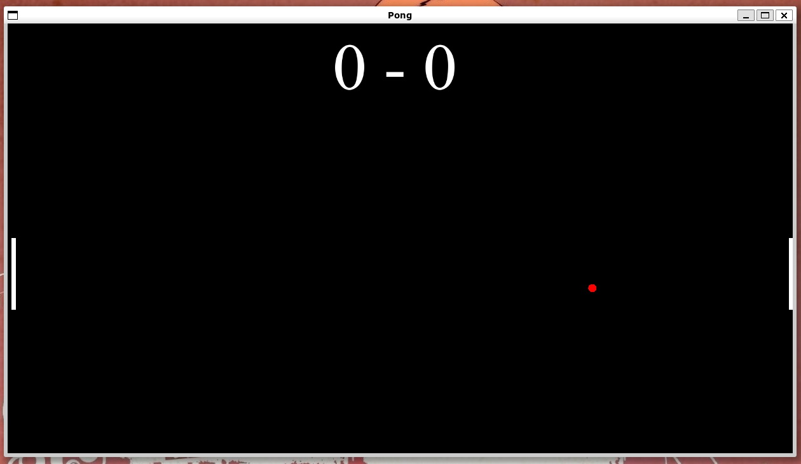

# p1nG-p0nG



## Table of Contents

1. [Task](#task)
2. [Design](#design)  
3. [Solution](#solution)
4. [Changes](#changes)
5. [Testing](#testing)
6. [References](#references)  

## Task.  
The goal of the game is to hit the ball in the way that an opponent cannot hit it back and the ball goes beyond the end of the opponent’s zone. In this game there is no end, but users can exit the game through the menu on ESC button. Requirements for the application:

1) Be a multiplatform application, because it uses SFML library that supports this feature;
2) Show the user a menu, so that they can choose to play or exit the game;
3) The ball will ricochet off the court bounds with an angle equal to the incident angle. If the ball hits the paddle, it will bounce off with an angle based on the point of impact;
4) If a player misses a ball, their opponent will be awarded with one point;
5) Show the score board;
6) When user decides to exit, the game show the scores, and if it is the highest score then store it in the text file.	

Before the reset, the menu is displayed with three options: play, options, exit. Option “options” should have included the possibility to change characteristics of paddles and a ball: their dimensions, position, and velocity. However, in this program you can only change it manually through constants in headers. (Chosen option is highlighted in gray)


After the play button is pushed, the game starts.

Initial score is 0-0, then the game plays as it should till the user decides to exit the game via ESC key and Exit button. Controls are W, S for left paddle and O, L for right paddle.


When we exit the program, it displays the score and highscore. In this example if it gets more than 10, then it congratulates the user.


## Design.


## Solution.
 

There are four classes in total, but two of the are external library heavy: Graphics and Menu.

Class Paddle has 4 private attributes: 

```
sf::Vector2<float> m\_position;
```

this type works as a mathematical vector that stores values of x and y, unlike std::vector.

The rest are self-explanatory

```
int m\_width;			

int m\_height;

int m\_score;
```


```
const int PADDLE\_VELOCITY\_UP = 40;

const int PADDLE\_VELOCITY\_DOWN = -40;
```
The methods here are very straightforward. The only part that is confusing is with the axis and coordination. Origin is in the top left of the screen, so it is (0,0) and bottom right is (1920,1080). Also update() is for drawing graphics.


Next is a Ball class with such private attributes:

Velocity depends on x and y velocities.

```
sf::Vector2<float> m\_position;

sf::Vector2<float> m\_velocity;

int m\_radius; 
```


```
Update(Paddle\*, Paddle\*, int)
```

It is a collision manager: if it hits top or bottom then invert y velocity, if it hits left or right paddle invert x velocity.

Rest is in main:

The most interesting part is in the case of exiting the game: file handling and exception management. When we want to load the highscore to compare with the current score we load the value from txt file, but what if it did not exist before calling it? As we can see it loads a negative value.


We need to set the value to 0.


In case of file handling we try to load the file and withdraw the value from it. Then compare it with the user’s score: if it is larger than user’s then it stays the same; otherwise, it stores the user’s score in the txt file as a highscore, and we successfully close it.


## Changes

I need no inheritance and polymorphism in the program, because all classes are distinct.

## Testing:

1) Drawing the menu and check selection.

This tests the display of the menu and ability to select play or exit. Menu passed its test.

2) Drawing objects and score table:

This test verifies that the paddles, the ball, and the score table is precisely at given positions with the given attributes (length, radius, and etc.).

3) Paddle and Ball movement

This test checks the speed and boundary collision. The ball should ricochet of the top and bottom walls at the angle equal to the incident angle. Same with paddles, but different coordinate.

4) Checking for exiting the game

This test is meant to verify the load and save of the highscore on condition to exit the game. If the score is higher than highscore, it becomes a new highscore and saves into the txt file.

In conclusion, all the tests verified the requirements. Everything was successful.


## References

I used external sources mainly for sfml library. For example, [how to create basic menu class:](https://www.youtube.com/watch?v=4Vg9d1pjL20)

Or how to change resolution (resize it).
